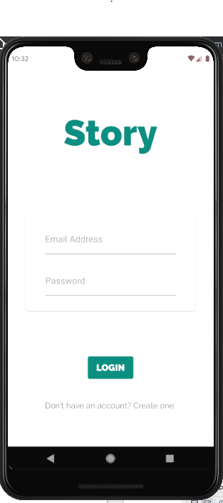
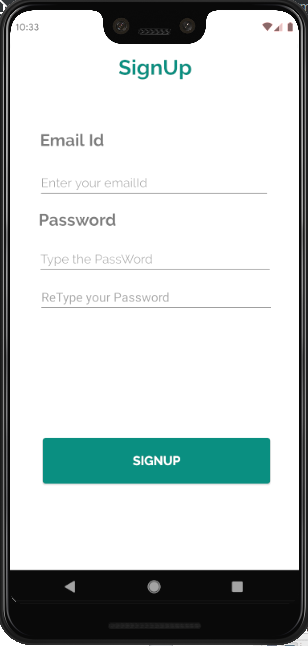
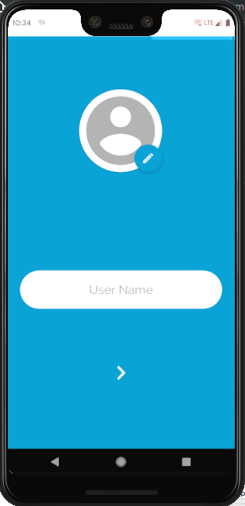
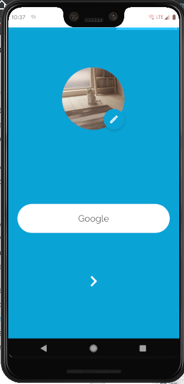
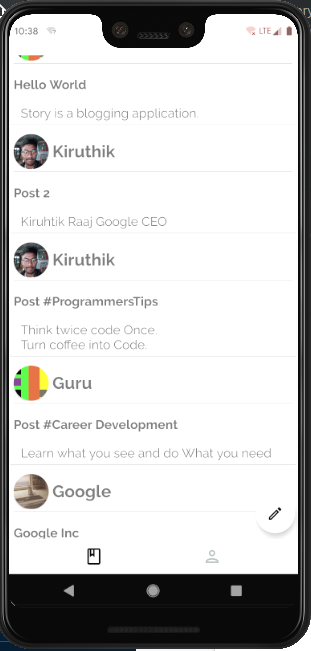
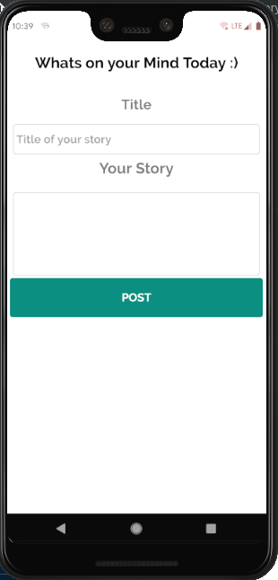
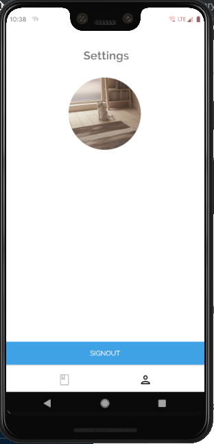

# Story
Story is a blogging app(Android).The reason why I created is to connect my classmates where they can tell about what they think and what they need for their development. I used Google Firebase for my authentication and database storage. Also I just added the screen shots of my blogging app. We can also add a username and display picture of the users. This may be very helpful for my classmates and also we can blog anything that can make others feel good. I used Android Studio as the Development kit and Java as my programming language.

## Screenshots

### Login Page

### Signup Page

### Update Account

### Blogs

### AddBlogs

  

### Settings

  
 

